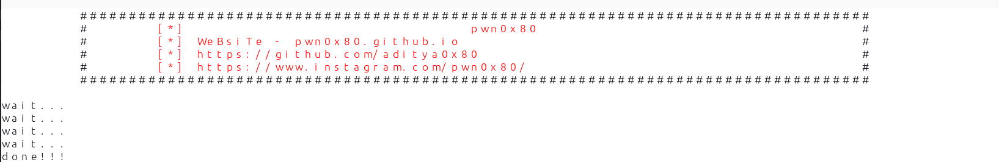

# anime-link-scraper

# Supported Websites
- https://www1.gogoanime.ai

## Dependencies Installation
1.) sudo apt install python3

2.) Browse to the directory of this script and open command prompt/shell in that directory and run this command :
```
pip3 install -r requirements.txt
```

# Usage
## Specific anime link scrape
https://youtu.be/1kuOPOlIICE
```
python3 anime-link-scaper.py ANIME-URl

```

### demo -
```
 python3 anime-link-scaper.py https://www1.gogoanime.ai/category/durarara-dub
 
```

## Entire anime link scrape
https://studio.youtube.com/video/U0iSgUVIKp0/edit

```
chmod +x run.sh
./run.sh
```

### link store at anime_link folder

## About Us
website - pwn0x80@github.io
instagram -  https://www.instagram.com/pwn0x80/
